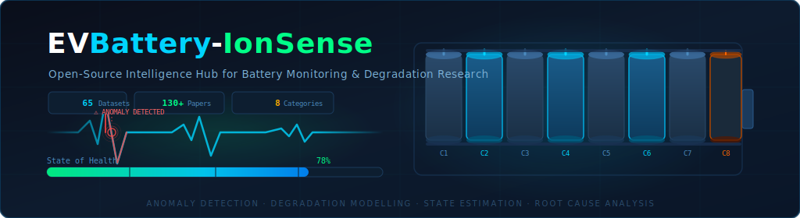

# ⚡ EVBattery-IonSense

### A curated open-source intelligence hub for EV battery monitoring, degradation research, and AI-powered health estimation

---

## 🎯 About This Repository

**EVBattery-IonSense** curates open-source datasets and research literature across the full battery intelligence stack — from raw field telemetry and lab aging experiments to thermal failure characterisation and AI-driven state estimation.

Whether you are building a **battery health model**, benchmarking a **degradation algorithm**, or studying **failure mechanisms**, this repository helps you find the right data fast — with direct download links, related publications, and structured categorisation.

> We gratefully acknowledge the original publishers and contributors of all datasets listed here. Please cite the original sources and follow the respective licence terms when using any data.

---

## 📊 At a Glance

| Category | Datasets |
|---|---|
| 🚗 Field & Real-World EV Data | 11 |
| 🔬 Lab Aging & Degradation | 23 |
| 🔥 Safety, Failure & Thermal Runaway | 4 |
| 📡 State Estimation & Health Monitoring | 12 |
| ⚡ Electrochemical Characterisation | 6 |
| 🖼️ Battery Imaging (CT, X-ray, Ultrasound) | 3 |
| ♻️ Second-Life, Recycling & Grid Storage | 4 |
| 🛸 Aerospace & Specialised Applications | 5 |

---

## 📚 Dataset Index

- [🚗 Field & Real-World EV Data](#-field--real-world-ev-data)
- [🔬 Lab Aging & Degradation Studies](#-lab-aging--degradation-studies)
- [🔥 Safety, Failure & Thermal Runaway](#-safety-failure--thermal-runaway)
- [📡 State Estimation & Health Monitoring](#-state-estimation--health-monitoring)
- [⚡ Electrochemical Characterisation & Modelling](#-electrochemical-characterisation--modelling)
- [🖼️ Battery Imaging](#-battery-imaging)
- [♻️ Second-Life, Recycling & Grid Storage](#-second-life-recycling--grid-storage)
- [🛸 Aerospace & Specialised Applications](#-aerospace--specialised-applications)
- [🌐 Open Data Repositories](#-open-data-repositories)

---

## 🚗 Field & Real-World EV Data

Real-world measurements from deployed vehicles, fleets, and home storage systems — the hardest data to obtain and the most valuable for production-grade models.

---

### 1. Multi-Year Field Measurements of Home Storage Systems
**Source**: ISEA / CARL, RWTH Aachen University | **Scale**: 21 systems · 106 system-years · 14 billion data points

Field measurements from 21 private home storage systems combined with residential photovoltaic installations across Germany (2015–2022). Measurements include system-level battery current, voltage, power, housing temperature, and room temperature at 1-second resolution. Data comprises 1,270 monthly files across 21 system folders.

- 📥 **[Download Dataset](https://zenodo.org/records/12091223)**
- 📄 Related Articles:
  - [Multi-year field measurements of home storage systems and their use in capacity estimation](https://www.nature.com/articles/s41560-024-01620-9#data-availability)
  - [Capacity estimation of home storage systems using field data](https://www.nature.com/articles/s41560-024-01662-z)
  - [Battery Charts](https://battery-charts.rwth-aachen.de/main-page/)

---

### 2. Lithium-Ion Battery Field Data: 28 LFP Systems (Up to 5 Years)
**Source**: Industry partner (anonymised) | **Scale**: 28 systems · 133 million rows

Field data from 28 portable 24 V LFP battery systems (≈160 Ah), each with 8 prismatic cells in series, cell-level voltage sensing, pack current, and 4 inter-cell temperature sensors. All units were returned due to unsatisfactory behaviour — making this a uniquely valuable fault-biased dataset. Operational spans range from one month to five years.

- 📥 **[Download Dataset](https://zenodo.org/records/13715694)**
- 📄 Related Articles:
  - [Gaussian Process-based Online Health Monitoring and Fault Analysis of Lithium-Ion Battery Systems from Field Data](https://www.cell.com/cell-reports-physical-science/fulltext/S2666-3864(24)00563-0?_returnURL=https%3A%2F%2Flinkinghub.elsevier.com%2Fretrieve%2Fpii%2FS2666386424005630%3Fshowall%3Dtrue)

---

### 7. Lithium-Ion Battery Aging Dataset Based on EV Real-Driving Profiles
**Source**: Stanford Energy Control Laboratory | **Scale**: 28 months · INR21700-M50T cells

Aging data for cells subjected to Urban Dynamometer Driving Schedule (UDDS) discharge and CC-CV charging. Periodic diagnostic tests include capacity measurement, HPPC, and Electrochemical Impedance Spectroscopy (EIS), capturing battery degradation under realistic driving conditions.

- 📥 **[Download Dataset](https://osf.io/qsabn/?view_only=2a03b6c78ef14922a3e244f3d549de78)**
- 📄 Related Articles:
  - [Lithium-ion battery aging dataset based on electric vehicle real-driving profiles](https://www.sciencedirect.com/science/article/pii/S2352340922002062?via%3Dihub)
  - [Domain knowledge-guided machine learning framework for state of health estimation](https://www.nature.com/articles/s44172-024-00304-2#Abs1)

---

### 10. EV Field Datasets — Tsinghua (464 EVs)
**Source**: Tsinghua University | **Scale**: 464 EVs · 1.2M+ charging snippets

Three large-scale real-world EV datasets from three different vehicle types, providing detailed insights into real-world charging behaviours and usage patterns at fleet scale.

- 📥 **[Download Dataset](https://data.mendeley.com/datasets/mcsh4hnb8b/1)**

---

### 31. Predicting Battery End of Life from Solar Off-Grid Field Data
**Source**: Oxford University | **Scale**: 1,027 lead-acid batteries · Sub-Saharan Africa

Performance metrics from solar off-grid systems used in lighting, phone charging, and small appliances. A rare dataset from low-resource settings that challenges assumptions built on lab or Western EV data.

- 📥 **[Download Dataset](https://ora.ox.ac.uk/objects/uuid:e41d3d4c-f74e-4d76-81fd-0caa77ec6cec)**
- 📄 Related Articles:
  - [Predicting battery end of life from solar off-grid system field data using machine learning](https://www.cell.com/joule/fulltext/S2542-4351(21)00532-8)

---

### 37. Challenges and Opportunities in Truck Electrification — Big Operational Data
Large-scale operational data from commercial electric trucks, revealing real-world range, charging, and degradation challenges in heavy-duty electrification.

- 📥 **[Download Dataset](https://springernature.figshare.com/articles/dataset/Challenges_and_opportunities_in_truck_electrification_unveiled_by_big_operational_data/24421210?file=44809303)**
- 📄 Related Articles:
  - [Challenges and opportunities in truck electrification revealed by big operational data](https://www.nature.com/articles/s41560-024-01602-x#Abs1)

---

### 40. Battery Capacity Prognostics Dataset for On-Road Electric Vehicles
**Scale**: 20 EVs · 29 months

Charging data with statistically derived capacity labels and data-driven features, optimised for capacity degradation modelling in real on-road vehicles.

- 📥 **[Download Dataset](https://github.com/shiyunliu-battery/battery-charging-data-of-on-road-electric-vehicles)** *(GitHub repository)*
- 📄 Related Articles:
  - [Prognostics of battery capacity based on charging data and data-driven methods for on-road vehicles](https://www.sciencedirect.com/science/article/pii/S0306261923003185#ab005)

---

### 45. Synthetic Duty Cycles from Real-World Autonomous EV Driving
Synthetic load profiles derived from autonomous EV real-world driving data, enabling controlled lab experiments that are grounded in realistic usage.

- 📥 **[Download Dataset](https://purl.stanford.edu/ky011nj6376)**
- 📄 Related Articles:
  - [Synthetic duty cycles from real-world autonomous electric vehicle driving](https://www.sciencedirect.com/science/article/pii/S2666386423003314)

---

### 46. Model-Constrained Deep Learning for Online Fault Diagnosis in Li-ion Batteries
**Source**: BMS cloud platform | **Scale**: 515 vehicles · 18.2 million valid entries

Cloud-uploaded BMS data from three battery manufacturers (anonymised). Includes rare critical failure samples: thermal runaway, electrolyte leakage, internal short circuit, and excessive ageing.

- 📥 **[Download Dataset](https://zenodo.org/records/10656500)**
- 📄 Related Articles:
  - [Model-constrained deep learning for online fault diagnosis in Li-ion batteries over stochastic conditions](https://www.nature.com/articles/s41467-025-56832-8)

---

### 56. BEV Energy Dynamics Dataset
**Source**: KU Leuven | **Resolution**: 1-second time series

High-resolution measurements of actual energy values across charger, battery system, and auxiliary devices. Covers charging, driving, and parking across diverse conditions — well-suited for smart charging, energy management, and AI-based predictive modelling.

- 📥 **[Download Dataset](https://rdr.kuleuven.be/dataset.xhtml?persistentId=doi:10.48804/8KPDTW)**
- 📄 Related Articles:
  - [Unveiling Energy Dynamics of Battery Electric Vehicle Using High-Resolution Data](https://www.nature.com/articles/s41597-025-06148-5#Abs1)

---

### 61. Electric Vehicle Usage Data Set for Battery Aging Studies
**Scale**: 28 LFP systems · Up to 5 years · ~133 million rows

Real-world field measurements from 28 portable 24 V LFP battery systems with 8 prismatic cells in series. All units were returned due to abnormal behaviour, making this a fault-biased dataset. Distinct from Dataset 2 — published separately with different scope.

- 📥 **[Download Dataset](https://github.com/TUMFTM/electric-vehicle-uds-dataset/tree/main)**
- 📄 Related Articles:
  - [Lab-to-field gap in battery aging studies](https://www.sciencedirect.com/science/article/pii/S2590116825001250?via%3Dihub#d1e4342)

---

## 🔬 Lab Aging & Degradation Studies

Controlled laboratory experiments spanning calendar aging, cycle aging, temperature effects, and degradation mode analysis across a wide range of cell chemistries and formats.

---

### 4. Second-Life Lithium-Ion Battery Aging Dataset Based on Grid Storage Cycling
**Source**: Stanford Energy Control Lab | **Chemistry**: NMC

Six NMC cells cycled using residential and commercial synthetic duty cycles. Purpose-built for studying second-life degradation under grid storage conditions.

- 📥 **[Download Dataset](https://osf.io/8jnr5/)**
- 📄 Related Articles:
  - [Second-life lithium-ion battery aging dataset based on grid storage cycling](https://www.sciencedirect.com/science/article/pii/S2352340924010084?via%3Dihub)

---

### 5. Dataset of Lithium-Ion Battery Formation and Structured Aging Cycling Data
**Source**: TRI (BEEP processed) | **Scale**: Formation + structured cycling data

Includes raw formation data and structured aging cycling data processed by TRI BEEP, with interpolated cycling data and cycle summaries. Enables insights into the role of electrode utilisation in extending battery cycle life.

- 📥 **[Download Dataset](https://data.matr.io/8/)**
- 📄 Related Articles:
  - [Data-driven analysis of battery formation reveals the role of electrode utilization in extending cycle life](https://www.cell.com/joule/abstract/S2542-4351(24)00353-2)

---

### 6. Full Factorial DOE Dataset for Parallel-Connected Lithium-Ion Cells
**Source**: Stanford Energy Control Laboratory | **Scale**: 54 test conditions

Full factorial design of experiments on ladder-configured parallel strings. Varies temperature, cell-to-cell interconnection resistance, chemistry (NCA/NMC), and aging level. Includes individual cell current and temperature distributions.

- 📥 **[Download Dataset](https://data.mendeley.com/datasets/zh58byr53c/1)**
- 📄 Related Articles:
  - [Unveiling the performance impact of module level features on parallel-connected lithium-ion cells via explainable ML](https://www.sciencedirect.com/science/article/pii/S2352152X24003670?via%3Dihub)

---

### 8. Experimental Data — Galvanostatic Discharge at Different C-Rates and Temperatures
Detailed measurements of voltage, current, and skin temperature for three lithium-ion batteries tested under galvanostatic discharge at various C-rates and temperatures via Arbin system.

- 📥 **[Download Dataset](https://data.mendeley.com/datasets/kxsbr4x3j2/2)**
- 📄 Related Articles:
  - [Experimental data of lithium-ion batteries under galvanostatic discharge tests at different rates and temperatures](https://www.sciencedirect.com/science/article/pii/S2352340921001785?via%3Dihub)

---

### 9. Increasing Generalization Capability of Battery Health Estimation — Continual Learning
Pouch and prismatic cells aged under various temperatures and loading profiles. Includes partial Q curves during charging, capacities, and normalised SOH curves, with non-accelerated degradation experiment data.

- 📥 **[Download Dataset](https://data.mendeley.com/datasets/n3b54nsw8m/9)**
- 📄 Related Articles:
  - [Increasing generalization capability of battery health estimation using continual learning](https://www.sciencedirect.com/science/article/pii/S266638642300588X#abs0020)

---

### 11. Experimental Degradation Study of a Commercial Lithium-Ion Battery
**Source**: TUM | **Scale**: 196 cells · Silicon-doped graphite anode / NCA cathode

Calendar and cyclic aging under wide-ranging conditions, with periodic check-ups at 20°C. Reveals the effects of aging conditions on degradation patterns across a large cell population.

- 📥 **[Download Dataset](https://mediatum.ub.tum.de/1713382)**
- 📄 Related Articles:
  - [Experimental degradation study of a commercial lithium-ion battery](https://www.sciencedirect.com/science/article/pii/S0378775322014756#d1e1359)

---

### 13. Underlying Dataset for Battery Pack Degradation Under Thermal Gradients
Raw and processed data plus analysis codes for investigating aging in parallel-connected Li-ion battery packs under thermal gradients.

- 📥 **[Download Dataset](https://zenodo.org/records/10207731)**
- 📄 Related Articles:
  - [Degradation in parallel-connected lithium-ion battery packs under thermal gradients](https://www.nature.com/articles/s44172-023-00153-5#Abs1)

---

### 26. Data-Driven Prediction of Battery Cycle Life Before Capacity Degradation
**Source**: Stanford / MIT | The seminal early-prediction dataset

Enables prediction of battery cycle life before significant capacity degradation occurs. A foundational dataset widely used in early RUL research.

- 📥 **[Download Dataset](https://data.matr.io/1/)**
- 📄 Related Articles:
  - [Data-driven prediction of battery cycle life before capacity degradation](https://www.nature.com/articles/s41560-019-0356-8)

---

### 27. Physics-Informed Neural Network for Lithium-Ion Battery Degradation Modelling
**Scale**: 55 NCM 18650 cells · 6 charge/discharge strategies

Supports physics-informed neural network modelling for stable degradation analysis and prognosis across diverse operating conditions.

- 📥 **[Download Dataset](https://zenodo.org/records/10963339)**
- 📄 Related Articles:
  - [Physics-informed neural network for lithium-ion battery degradation stable modeling and prognosis](https://www.nature.com/articles/s41467-024-48779-z)

---

### 29. Prognosis of Multivariate Battery State via Transformers
Processed files for multivariate battery state prediction using transformer architectures. Includes LFP fast-charging and six cathode chemistry datasets.

- 📥 **[Download Dataset](https://www.materialsdatafacility.org/detail/spacetimeformer_battery_v1.2)**
- 📄 Related Articles:
  - [Prognosis of Multivariate Battery State of Performance and Health via Transformers](https://arxiv.org/abs/2309.10014)
  - [Multivariate prognosis of battery advanced state of health via transformers](https://www.cell.com/cell-reports-physical-science/fulltext/S2666-3864(24)00177-2)

---

### 30. Battery Aging Modes Across NMC Compositions
**Scale**: 44 NMC/Gr single-layer pouch cells

Cycle-by-cycle capacity, Coulombic efficiency, and end-of-charge/discharge voltages. Includes code for battery aging mode classification using ML.

- 📥 **[Download Dataset](https://zenodo.org/records/7250553)**
- 📄 Related Articles:
  - [Battery aging mode identification across NMC compositions using machine learning](https://www.cell.com/joule/fulltext/S2542-4351(22)00525-6)

---

### 32. ISU-ILCC Battery Aging Dataset
**Source**: Iowa State University / University of Connecticut | **Scale**: 238 cells · 63 aging conditions

Li-ion polymer cells cycled under varying charge rate, discharge rate, and depth of discharge. Designed for studying stress factor dependencies in capacity fade.

- 📥 **[Download Dataset](https://iastate.figshare.com/articles/dataset/_b_ISU-ILCC_Battery_Aging_Dataset_b_/22582234)**
- 📄 Related Articles:
  - [Predicting battery lifetime under varying usage conditions from early aging data](https://www.cell.com/cell-reports-physical-science/fulltext/S2666-3864(24)00127-9)

---

### 33. Comprehensive Battery Aging Dataset: NMC/C-SiO Capacity & Impedance Fade
**Source**: KIT | **Scale**: 228 cells · 3 billion data points · ~600 days

Wide-range operating conditions for NMC/C+SiO cells. One of the most comprehensive publicly available aging datasets for this chemistry.

- 📥 **[Download Dataset](https://radar.kit.edu/radar/en/dataset/kww7jv8ajuvchcah)**
- 📄 Related Articles:
  - [Comprehensive battery aging dataset: capacity and impedance fade measurements of NMC/C-SiO cell](https://www.nature.com/articles/s41597-024-03831-x)
  - [Bidirectional Charging Systems and Battery Lifetime Modeling for Vehicle-to-Grid Applications](https://publikationen.bibliothek.kit.edu/1000174456)

---

### 38. Dynamic Cycling Enhances Battery Lifetime
Dynamic discharge profiles representative of EV driving vs. constant-current profiles. Findings show up to 38% increase in equivalent full cycles at end-of-life under dynamic profiles.

- 📥 **[Download Dataset](https://purl.stanford.edu/td676xr4322)**
- 📄 Related Articles:
  - [Dynamic cycling enhances battery lifetime](https://www.nature.com/articles/s41560-024-01675-8#data-availability)

---

### 39. Stanford Long-Term Calendar Aging Dataset
**Scale**: 8 cell types · 2 SOC levels · 4 temperatures · Raw diagnostic data

Calendar aging data from eight cell types (LFP, NCR, VTC6, and others) stored at 24°C, 45°C, 60°C, and 85°C. Provides decade-scale aging insights.

- 📥 **[Download Dataset](https://osf.io/ju325/)**
- 📄 Related Articles:
  - [A decade of insights: Delving into calendar aging trends and implications](https://www.cell.com/joule/fulltext/S2542-4351(24)00510-5)

---

### 42. WMG Calendar Aging Dataset — LGM50 Commercial Cells (39 Storage Conditions)
Calendar aging from LGM50 cells at 0°C, 25°C, and 45°C across 13 SOC levels per temperature. Two-year per condition storage tests with regular RPTs.

- 📥 **[Download Dataset](https://zenodo.org/records/14577286)**
- 📄 Related Articles:
  - [Lithium-Ion Battery Degradation Modelling Using Universal Differential Equations](https://www.sciencedirect.com/science/article/pii/S0306261924026059)

---

### 43. Cycle Aging Data of Automotive-Grade Li-ion Cells Under Realistic Conditions (VW ID.3)
**Source**: TUM | **Chemistry**: NMC|Gr pouch cells (VW ID.3)

Three automotive-grade cells subjected to three usage patterns over 3+ years. One of the few publicly available datasets specifically from a production EV cell.

- 📥 **[Download Dataset](https://mediatum.ub.tum.de/1748915)**
- 📄 Related Articles:
  - [Understanding lithium-ion battery degradation in vehicle applications: VW ID.3 pouch cells](https://www.sciencedirect.com/science/article/pii/S2352152X25000702)

---

### 47. Comprehensive Cycle Aging Data and Analysis for Commercial 21700 Cells
Well-structured repository containing summary data, processed time-series, and raw data. Includes degradation mode analysis, resistance measurements, and aging statistics with Jupyter notebook for easy parsing.

- 📥 **[Download Dataset](https://zenodo.org/records/10637534)**
- 📄 Related Articles:
  - [Lithium-ion battery degradation: Comprehensive cycle ageing data for commercial 21700 cells](https://www.sciencedirect.com/science/article/pii/S0378775324001368)
  - [The importance of degradation mode analysis in parameterising lifetime prediction models](https://www.nature.com/articles/s41467-025-57968-3)

---

### 50. Aging Dataset — LCO Battery with Mechanical Measurements
**Scale**: 22Ah LCO-graphite pouch · 1125 cycles to 70% SOH

Includes cycling RPTs, HPPC tests, and low-rate cycles. Uniquely provides mechanical (differential pressure) measurements alongside electrochemical data.

- 📥 **[Download Dataset](https://zenodo.org/records/14914172)**
- 📄 Related Articles:
  - [Aging diagnostics in lithium-ion batteries with differential mechanical measurements](https://www.sciencedirect.com/science/article/pii/S0306261925002545)

---

### 51. Battery Degradation Dataset Based on a Forklift Mission Profile
Degradation data from cells cycled under a forklift mission profile — an under-represented industrial application in the literature.

- 📥 **[Download Dataset](https://www.sciencedirect.com/article/pii/S2352340923009228)**
- 📄 Related Articles:
  - [Dataset of lithium-ion battery degradation based on a forklift mission profile](https://www.sciencedirect.com/article/pii/S2352340923009228)
  - [Sensitivity analysis for reliable state-of-health estimation based on battery partial charging](https://www.sciencedirect.com/article/pii/S2666386425002450)

---

### 57. Multi-Stage Lithium-Ion Battery Aging Study
**Source**: Research consortium | **Scale**: 279 cells · 71 aging scenarios · Samsung INR21700-50E

Two experimental phases combining non-model-based and model-based optimal experimental design. Supports lifetime prediction, physics-based model parameterisation, and aging relationship discovery.

- 📥 **[Download Dataset](https://figshare.com/articles/dataset/Multi-Stage_Lithium_Ion_Battery_Aging_Study/25975315)**
- 📄 Related Articles:
  - [A multi-stage lithium-ion battery aging dataset using various experimental design methodologies](https://www.nature.com/articles/s41597-024-03859-z)

---

### 63. UConn LCO/Gr Battery Fast Charging Dataset
**Source**: REIL, University of Connecticut | **Scale**: 76 coin cells · SOC-sweep + benchmark protocols

SOC-sweep tests at four SOH levels (100%–70%) and 1.5C–3.5C charge rates. Benchmark tests with repeated RPTs until 70% end-of-life capacity.

- 📥 **[Download Dataset](https://digitalcommons.lib.uconn.edu/reil_datasets/4/)**
- 📄 Related Articles:
  - [Coulombic efficiency-driven optimization of health-aware charging protocols](https://pubs.rsc.org/en/content/articlelanding/2026/ta/d5ta09520d)

---

### 65. Discovery Learning Predicts Battery Cycle Life from Minimal Experiments
**Source**: Industrial grade | **Scale**: 123 large-format cells (73–84 Ah) · 8 cell types · 1,700 EFC max

NMC811 and NMC9/Si–C cells under diverse conditions. Provides full capacity-retention trajectories plus high-resolution early-cycle data (first 50 EFCs). Organised into 37 groups to capture manufacturing variability.

- 📥 **[Download Dataset](https://zenodo.org/records/17654407)**
- 📄 Related Articles:
  - [Discovery Learning predicts battery cycle life from minimal experiments](https://www.nature.com/articles/s41586-025-09951-7)

---

## 🔥 Safety, Failure & Thermal Runaway

Abuse test data, thermal runaway characterisation, and fault detection datasets — critical for safety model development.

---

### 3. Battery Failure Databank (NREL)
**Source**: National Renewable Energy Laboratory | **Scale**: Hundreds of abuse tests

Covers nail penetration, thermal abuse, and internal short-circuit testing. Provides heat output, ejected mass data, and test-to-test variability. Most tests include associated high-speed X-ray radiography videos.

- 📥 **[Access Dataset](https://www.nrel.gov/transportation/battery-failure.html)**
- 📄 Related Articles:
  - [Predicting the heat release variability of Li-ion cells under thermal runaway with few or no calorimetry data](https://www.nature.com/articles/s41467-024-52653-3)
  - [The battery failure databank: Insights from an open-access database of thermal runaway behaviors](https://www.sciencedirect.com/science/article/pii/S0378775324000570)
  - [Decoupling of heat generated from ejected and non-ejected contents of 18650-format cells](https://www.sciencedirect.com/science/article/pii/S0378775318312205)
  - [Modelling and experiments to identify high-risk failure scenarios for testing safety of Li-ion cells](https://www.sciencedirect.com/science/article/pii/S0378775319300874)
  - [Characterising thermal runaway within lithium-ion cells by inducing and monitoring internal short circuits](https://pubs.rsc.org/en/content/articlelanding/2017/ee/c7ee00385d)
  - [Identifying the Cause of Rupture of Li-Ion Batteries during Thermal Runaway](https://onlinelibrary.wiley.com/doi/10.1002/advs.201700369)
  - [Tracking Internal Temperature and Structural Dynamics during Nail Penetration of Lithium-Ion Cells](https://iopscience.iop.org/article/10.1149/2.1501713jes)

---

### 48. Air-Cooled Li-Ion Battery Pack from a Plug-In Hybrid Vehicle (PHEV)
Real-world battery pack data extracted from a PHEV, enabling physics-informed deep learning for thermal fault detection.

- 📥 **[Download Dataset](https://borealisdata.ca/dataset.xhtml?persistentId=doi:10.5683/SP3/THZTJC)**
- 📄 Related Articles:
  - [Thermal fault detection of lithium-ion battery packs through an integrated physics and deep neural network based model](https://www.nature.com/articles/s44172-025-00409-2)

---

### 60. Battery Failure Detection and FPI Estimation During Cycling-to-Failure
Real-time tracking of battery cycling-to-failure, including Faradaic process indicator (FPI) estimation. Includes surface strain measurements for failure detection.

- 📥 **[Download Dataset](https://zenodo.org/records/17651045)**
- 📄 Related Articles:
  - [Seeing the unseen: Real-time tracking of battery cycling-to-failure via surface strain](https://www.cell.com/joule/fulltext/S2542-4351(25)00453-2)

---

### 55. Li-Ion Battery Pack Cycling Dataset with CC-CV Charging and WLTP/Constant Discharge Profiles
**Scale**: Up to 36 cells · 3 parallel branches · PARQUET format

Simulates dynamic driving conditions using WLTP cycle-derived current profiles from a Tesla Model 3 vehicle model. Records cell voltages, currents, surface temperatures, and pack-level resistance. Uses a CAN bus architecture with commercial automotive BMS units.

- 📥 **[Download Dataset](https://dataverse.csuc.cat/dataset.xhtml?persistentId=doi:10.34810/data2395)**

---

## 📡 State Estimation & Health Monitoring

Datasets and models for State of Charge (SoC), State of Health (SoH), and Remaining Useful Life (RUL) estimation.

---

### 12. Attention Towards Chemistry-Agnostic and Explainable Battery Lifetime Prediction (ARCANA)
Pre-trained model weights from the ARCANA framework, including models trained on lithium-ion and sodium-ion cells. Designed for explainable lifetime prediction across chemistries.

- 📥 **[Download Dataset](https://zenodo.org/records/10293072)**
- 📄 Related Articles:
  - [Attention towards chemistry agnostic and explainable battery lifetime prediction](https://www.nature.com/articles/s41524-024-01286-7)

---

### 20. Lithium Inventory Tracking as a Nondestructive Battery Evaluation Method
**Scale**: 12 datasets · Li–NMC 811 cells

Charge and discharge cycles under various formulations, configurations, and testing conditions. Supports lithium inventory tracking as a non-destructive monitoring technique.

- 📥 **[Download Dataset](https://osf.io/2w4k3/)**
- 📄 Related Articles:
  - [Lithium inventory tracking as a non-destructive battery evaluation and monitoring method](https://www.nature.com/articles/s41560-024-01476-z)

---

### 22. GIC/NMC Solar Battery Synthetic Data
**Scale**: 700,000+ unique voltage vs. capacity curves

Synthetically generated with varied cell parameters to account for cell-to-cell variations. Separate training and validation sets provided.

- 📥 **[Download Dataset](https://data.mendeley.com/datasets/rg8b2k2k28/1)**
- 📄 Related Articles:
  - [Data-driven direct diagnosis of Li-ion batteries connected to photovoltaics](https://www.nature.com/articles/s41467-023-38895-7)

---

### 23. Data-Driven Capacity Estimation from Voltage Relaxation
**Scale**: 3 commercial 18650 batteries · NCA, NCM, NCM+NCA chemistries

Cycling data, impedance measurements, and voltage relaxation tests. Useful for capacity estimation without full charge/discharge cycles.

- 📥 **[Download Dataset](https://zenodo.org/records/6405084)**
- 📄 Related Articles:
  - [Data-driven capacity estimation of commercial lithium-ion batteries from voltage relaxation](https://www.nature.com/articles/s41467-022-29837-w)

---

### 24. Impedance-Based Forecasting of Battery Performance Amid Uneven Usage
**Scale**: 88 commercial Li-ion coin cells

Cycled under multistage constant current with randomly changed currents between cycles to simulate realistic usage. Explores impedance as a predictor for future performance under non-uniform usage.

- 📥 **[Download Dataset](https://zenodo.org/records/6645536)**
- 📄 Related Articles:
  - [Impedance-based forecasting of lithium-ion battery performance amid uneven usage](https://www.nature.com/articles/s41467-022-32422-w)

---

### 25. Identifying Degradation Patterns via Impedance Spectroscopy and Machine Learning
Dataset supporting ML-based identification of degradation patterns through electrochemical impedance spectroscopy analysis.

- 📥 **[Download Dataset](https://zenodo.org/records/3633835)**
- 📄 Related Articles:
  - [Identifying degradation patterns of lithium-ion batteries from impedance spectroscopy using machine learning](https://www.nature.com/articles/s41467-020-15235-7)

---

### 28. Real-Time Personalized Health Status Prediction via Deep Transfer Learning
**Scale**: 77 LFP/graphite cells · Identical charge, varying discharge protocols

Enables real-time health prediction using deep transfer learning across different usage profiles.

- 📥 **[Download Dataset](https://data.mendeley.com/datasets/nsc7hnsg4s/2)**
- 📄 Related Articles:
  - [Real-time personalized health status prediction of lithium-ion batteries using deep transfer learning](https://pubs.rsc.org/en/content/articlehtml/2022/ee/d2ee01676a)

---

### 35. Generative Learning Assisted State-of-Health Estimation for Battery Recycling
Source data accompanying a generative learning framework for SoH estimation under random retirement conditions — bridging battery diagnostics and sustainable recycling.

- 📥 **[Download Dataset](https://www.nature.com/articles/s41467-024-54454-0#Sec19)**
- 📄 Related Articles:
  - [Generative learning assisted SoH estimation for sustainable battery recycling](https://www.nature.com/articles/s41467-024-54454-0)

---

### 41. WMG-DIB Dataset — Rapid SoH Estimation via EIS and ML
**Scale**: 25 cylindrical cells · 5 SOH breakpoints (80%–100%)

Reference performance tests, EIS measurements across SOC and temperature, and derived metrics from EIS plots. Designed specifically for rapid SoH estimation.

- 📥 **[Download Dataset](https://data.mendeley.com/datasets/mn9fb7xdx6/3)**
- 📄 Related Articles:
  - [Dataset for rapid SoH estimation of lithium batteries using EIS and machine learning](https://www.sciencedirect.com/article/pii/S2352340923002767)

---

### 44. Retired Lithium-Ion Batteries Dataset
Dataset supporting capacity estimation of retired batteries using random charging segments from large-scale real-world data.

- 📥 **[Download Dataset](https://zenodo.org/records/14562266)**
- 📄 Related Articles:
  - [Capacity estimation of retired lithium-ion batteries using random charging segments from real-world data](https://www.sciencedirect.com/article/pii/S2666386425000438)

---

### 53. Ultrasonic and Deep-Learning Dataset for Real-Time SoC Estimation in Large-Format Cells
Experimentally collected ultrasonic waveforms from large-format Li-ion pouch cells during controlled charge/discharge. Four sensors arranged for multiple actuator–receiver paths. Provided as both raw CSV waveforms and CNN-ready image representations.

- 📥 **[Download Dataset](https://github.com/hfarhaditolie/Ultrasonic-SoC)**
- 📄 Related Articles:
  - [Large format battery SoC estimation: ultrasonic sensing and deep transfer learning](https://www.sciencedirect.com/article/pii/S2666546825001946)
  - [Ultrasonic guided waves as an indicator for the state-of-charge of Li-ion batteries](https://www.sciencedirect.com/article/pii/S0378775323005645)

---

### 62. Mechanistically Guided Residual Learning Dataset for Battery State Monitoring
Electrochemical characterisation and long-term cycling data from prismatic and pouch cells. Combines OCV measurements, cycling trajectories, and physics-based features with data-driven residual learning. Covers full-life degradation modelling.

- 📥 **[Download Dataset](https://zenodo.org/records/17591942)**
- 📄 Related Articles:
  - [Mechanistically guided residual learning for battery state monitoring throughout life](https://www.nature.com/articles/s41467-025-67565-z)

---

## ⚡ Electrochemical Characterisation & Modelling

Datasets focused on OCV curves, impedance spectra, half-cell measurements, and electrochemical–thermal model parameterisation.

---

### 21. Probability Distributed Equivalent Circuit Model Dataset
Supports development of a physically motivated voltage hysteresis model leveraging probability distributed equivalent circuits for enhanced performance prediction accuracy.

- 📥 **[Download Dataset](https://zenodo.org/records/10852930)**
- 📄 Related Articles:
  - [A physically motivated voltage hysteresis model for lithium-ion batteries using a probability distributed equivalent circuit](https://www.nature.com/articles/s44172-024-00221-4)

---

### 34. Source Data: Internal Sensors in a Smart Battery — Impact on Local Graphite Lithiation
Reveals how embedded internal sensors affect the graphite lithiation mechanism, providing rare insight into instrumented cell behaviour.

- 📥 **[Access Source Data](https://www.nature.com/articles/s41467-024-54656-6#Sec14)**
- 📄 Related Articles:
  - [Revealing how internal sensors in a smart battery impact the local graphite lithiation mechanism](https://www.nature.com/articles/s41467-024-54656-6)

---

### 59. Rate Capability, OCV, Impedance, and Half-Cell Data — Sodium-Ion and LFP Batteries
Comprehensive electrochemical characterisation of two sodium-ion batteries (layered oxide cathodes) and one LFP cell. Includes pseudo-OCV, GEIS-based OCV, GEIS, R-DC, and rate capability results. Designed for systematic comparison between sodium-ion and lithium-ion technologies.

- 📥 **[Download Dataset](https://doi.org/10.14459/2024mp1762675)**
- 📄 Related Articles:
  - [Comparing the electrical performance of commercial sodium-ion and lithium-iron-phosphate batteries](https://www.sciencedirect.com/article/pii/S0378775325001260)

---

### 64. Data Repository for Electrochemical-Thermal Modelling of High Power Li-Ion Pouch Cells
**Chemistry**: LFP/graphite · **Conditions**: Up to 10C, multi-SOC and C-rate tests

Controlled CC discharge, pulse protocols, and high-resolution lock-in thermography for spatially resolved heat generation. Supports electrochemical–thermal model development for automotive high-power applications.

- 📥 **[Download Dataset](https://ora.ox.ac.uk/objects/uuid:fe9bad3e-8a72-4e3b-8f01-fec3324b6758)**
- 📄 Related Articles:
  - [Electrochemical–thermal modelling of high power Li-ion pouch cells](https://www.sciencedirect.com/article/pii/S037877532502600X)

---

### 19. A Cross-Scale Framework for Evaluating Flexibility Values of Battery and Fuel Cell EVs
*(Dataset currently unavailable — code repository linked)*

- 💻 **[Code Repository](https://github.com/macroenergy/Dolphyn.jl)**
- 📄 Related Articles:
  - [A cross-scale framework for evaluating flexibility values of battery and fuel cell electric vehicles](https://www.nature.com/articles/s41467-023-43884-x)

---

### 58. Improving Real-World Execution of Optimised Trading Schedules for Large-Scale Battery Storage
**Source**: RWTH Aachen (Aachen, Germany) | **Resolution**: Second-by-second

Power flows, SoC at unit and system level, grid interaction, and optimised dispatch schedules from two real-world field trial configurations of a hybrid BESS.

- 📥 **[Download Dataset](https://publications.rwth-aachen.de/record/1015732)**
- 📄 Related Articles:
  - [Improving Real-World Execution of Optimised Trading Schedules for Large-Scale Battery Storage Systems](https://publications.rwth-aachen.de/record/1015732/files/Supplementary_file.pdf)

---

## 🖼️ Battery Imaging

CT scans, X-ray radiography, synchrotron imaging, and ultrasonic characterisation across multiple length scales.

---

### 52. A Dataset of Over 1,000 Computed Tomography Scans of Battery Cells
**Scale**: 1,015 commercially available battery cells scanned via X-ray CT

Radial and axial views for cylindrical cells; x-y, x-z, and y-z views for pouch and prismatic formats. Enables non-destructive internal structural analysis.

- 📥 **[Download Dataset](https://plus.figshare.com/articles/dataset/A_dataset_of_over_one_thousand_computed_tomography_scans_of_battery_cells/25330501)**
- 📄 Related Articles:
  - [A dataset of over one thousand computed tomography scans of battery cells](https://www.sciencedirect.com/article/pii/S235234092400581X)

---

### 54. Battery Imaging Library (BIL)
**Scale**: 80+ scans · 8 imaging modalities · 500 billion+ voxels

An open, curated repository spanning single particles to full cells. Includes raw, reconstructed, and processed data supporting multi-scale analysis and reproducible battery imaging research.

- 📥 **[Access Library](https://www.batteryimaginglibrary.com/search)**
- 📄 Related Articles:
  - [Battery Imaging Library: Multi-length scale and multi-modal synchrotron and laboratory data](https://chemrxiv.org/engage/chemrxiv/article-details/68d3b52b3e708a7649ffd0a5)

---

## ♻️ Second-Life, Recycling & Grid Storage

Data supporting battery reuse, second-life performance analysis, and grid-connected storage systems.

---

### 36. Source Data: Reuse and Recycling Pathway of Retired Batteries
Data and code for evaluating economic and environmental functions of different reuse versus recycling decisions for retired lithium-ion batteries.

- 💻 **[Code Repository](https://github.com/RuifeiMa/Reuse-and-recycling-pathway-of-retired-batteries)**
- 📄 Related Articles:
  - [Pathway decisions for reuse and recycling of retired lithium-ion batteries](https://www.nature.com/articles/s41467-024-52030-0)

---

### 49. Long-Term Sweat Testing Data for Second-Life Batteries
**Source**: Loughborough University | **Started**: 2019 (ongoing)

Long-term cycling from repurposed EV batteries under six real-world scenarios: time-of-use tariffs, PV self-consumption, and frequency response services. Recorded with Chroma 17020 battery cycler; processed into individual charge–discharge cycle CSV files.

- 📥 **[Download Dataset](https://repository.lboro.ac.uk/articles/online_resource/Long-Term_Sweat_Testing_Data_for_Second-Life_Batteries/28732490/2)**
- 📄 Related Articles:
  - [Long-Term Sweat Testing Dataset for Second-Life Batteries](https://www.nature.com/articles/s41597-025-05360-7)

---

## 🛸 Aerospace & Specialised Applications

NASA prognostics datasets and specialised battery test data from non-automotive platforms.

---

### 14. NASA Battery Data Set
Lithium-ion battery charge, discharge, and impedance experiments at different temperatures. A seminal dataset widely used in prognostics and health management (PHM) research.

- 📥 **[Download Dataset](https://phm-datasets.s3.amazonaws.com/NASA/5.+Battery+Data+Set.zip)**
- 📄 Related Articles:
  - [A framework for Li-ion battery prognosis based on hybrid Bayesian physics-informed neural networks](https://www.nature.com/articles/s41598-023-33018-0)

---

### 15. Randomized Battery Usage Data Set (NASA)
Batteries cycled with randomly generated current profiles, with periodic reference charging/discharging cycles for SOH benchmarking.

- 📥 **[Download Dataset](https://phm-datasets.s3.amazonaws.com/NASA/11.+Randomized+Battery+Usage+Data+Set.zip)**
- 📄 Related Articles:
  - [Adaptation of an electrochemistry-based Li-ion battery model to account for deterioration under randomized use](https://www.papers.phmsociety.org/index.php/phmconf/article/view/2490)
  - [A framework for Li-ion battery prognosis based on hybrid Bayesian physics-informed neural networks](https://www.nature.com/articles/s41598-023-33018-0)

---

### 16. HIRF Battery Data Set (NASA)
Battery data from experiments on the Edge 540 Aircraft in a High-Intensity Radiated Field (HIRF) Chamber.

- 📥 **[Download Dataset](https://phm-datasets.s3.amazonaws.com/NASA/15.+HIRF+Battery+Data+Set.zip)**
- 📄 Related Articles:
  - [Verification of a remaining flying time prediction system for small electric aircraft](https://papers.phmsociety.org/index.php/phmconf/article/view/2571)

---

### 17. Small Satellite Power Simulation (NASA)
Simulated experiments on BP930 satellite batteries using the MACCOR system. Designed for battery performance characterisation in small satellite mission profiles.

- 📥 **[Download Dataset](https://data.nasa.gov/download/cpqc-ztjh/application%2Fzip)**
- 📄 Related Articles:
  - [A battery certification testbed for small satellite missions](https://ieeexplore.ieee.org/abstract/document/7356483)

---

### 18. Accelerated Battery Life Testing (NASA)
Accelerated lifecycle data for 18650-cell Li-ion packs under constant, random loading, and second-life conditions.

- 📥 **[Download Dataset](https://data.nasa.gov/download/xg3n-ngei/application%2Fzip)**
- 📄 Related Articles:
  - [Prognosis of Li-ion Batteries Under Large Load Variations Using Hybrid Physics-Informed Neural Networks](https://papers.phmsociety.org/index.php/phmconf/article/view/3463)

---

## 🌐 Open Data Repositories

A curated list of trusted repositories and portals where additional battery datasets can be found:

| Repository | Description |
|---|---|
| [Battery Archive](https://batteryarchive.org/) | Centralised archive for Li-ion battery cycling data |
| [Zenodo](https://zenodo.org/) | General-purpose open science repository (CERN) |
| [Mendeley Data](https://data.mendeley.com/) | Research data sharing platform (Elsevier) |
| [Data Dryad](https://datadryad.org/stash) | Curated, open-access scientific data |
| [Battery Charts (RWTH)](https://battery-charts.de/) | Visualisation and analytics for battery datasets |
| [USABC](https://uscar.org/usabc/) | US Advanced Battery Consortium data resources |
| [US Data.gov](https://data.gov/) | US government open data portal |
| [EPA Dynamometer Schedules](https://www.epa.gov/vehicle-and-fuel-emissions-testing/dynamometer-drive-schedules) | Standard drive cycle profiles for EV testing |
| [Sandia RD&D Repository](https://www.sandia.gov/ess/tools-resources/rd-data-repository) | Sandia National Labs energy storage data |

---

## 🤝 Contributing

Contributions are welcome! If you know of an open battery dataset or research paper that belongs here:

1. Fork this repository
2. Add your entry following the existing format
3. Include: dataset description, direct download link, and related publications
4. Open a Pull Request with a short description of what you've added

Please ensure datasets are publicly accessible and that you verify any licence restrictions before submitting.

---

## 📜 Acknowledgements

All datasets listed in this repository remain the intellectual property of their original publishers and contributors. This repository serves as a navigational index only — it does not host or redistribute any data.

When using any dataset, please:
- Cite the original publication(s) listed under each entry
- Review and comply with the licence terms of the data source
- Contact the original authors for questions about data usage

---

*Built to accelerate battery AI research — from lab to fleet.*

